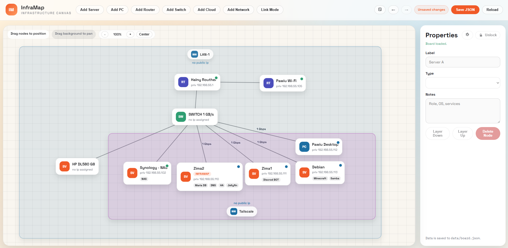

# InfraMap

Self-hosted infrastructure canvas for mapping servers, networks, and links.



## Features
- Draggable infinite canvas with pan/zoom
- Nodes: server, PC, router, switch, cloud, network
- Networks with resizable area and configurable header position
- Links between nodes + per-link speed labels
- Tags per node (DNS, DB, etc.)
- Per-device settings (ping, SSH, OS, credentials)
- Live status dots + logs console
- JSON storage for layout and config

## Quick start
Requirements: Go 1.24+ (see `go.mod` toolchain).

```bash
go run .
```

Open: `http://localhost:8080`

## Data files
- `data/board.json` - canvas layout, nodes, links
- `data/secrets.json` - encrypted device credentials/settings
- `data/secrets.key` - local encryption key (keep private)

## SSH + link speed detection
- Linux: uses `ethtool` or `/sys/class/net/<iface>/speed`
- Windows: uses PowerShell `Get-NetAdapter`

Make sure SSH is enabled on the target device and credentials are correct.

## Logs
Click the console icon to open logs. You will see ping results and SSH detection output.

## Security
Credentials are encrypted at rest in `data/secrets.json` using a locally generated key.
Do not commit `data/secrets.key` or `data/secrets.json` to public repos.

## Stack
- Backend: Go
- Frontend: HTML, CSS, JS
